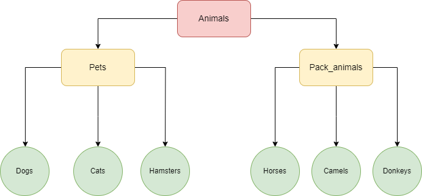

# Итоговая контрольная работа

1. Используя команду cat в терминале операционной системы Linux, создать два файла Домашние животные (заполнив файл собаками, кошками, хомяками) и Вьючные животными заполнив файл (Лошадьми, верблюдами и ослы), а затем объединить их. Просмотреть содержимое созданного файла. Переименовать файл, дав ему новое имя (Друзья человека).

```
vika@vika-2004:~$ cat > pets
dog
cat
hamster               
vika@vika-2004:~$ cat > pack_animals
horse
camel
donkey
vika@vika-2004:~$ cat pets pack_animals
dog
cat
hamster
horse
camel
donkey
vika@vika-2004:~$ cat pets pack_animals > animals
vika@vika-2004:~$ cat animals
dog
cat
hamster
horse
camel
donkey
vika@vika-2004:~$ mv animals human_friends
```

2. Создать директорию, переместить файл туда.

```
vika@vika-2004:~$ mkdir folder1 && mv human_friends ./folder1
vika@vika-2004:~$ cd folder1
vika@vika-2004:~/folder1$ ls
human_friends
```

3. Подключить дополнительный репозиторий MySQL. Установить любой пакет из этого репозитория

```
vika@vika-2004:~$ wget https://repo.mysql.com//mysql-apt-config_0.8.25-1_all.deb
--2024-02-06 22:02:16--  https://repo.mysql.com//mysql-apt-config_0.8.25-1_all.deb
Resolving repo.mysql.com (repo.mysql.com)... 23.210.253.161, 2a02:26f0:9500:b8a::1d68, 2a02:26f0:9500:b83::1d68
Connecting to repo.mysql.com (repo.mysql.com)|23.210.253.161|:443... connected.
HTTP request sent, awaiting response... 200 OK
Length: 18120 (18K) [application/x-debian-package]
Saving to: ‘mysql-apt-config_0.8.25-1_all.deb’

mysql-apt-config_0.8.25-1_all.de 100%[=========================================================>]  17,70K  --.-KB/s    in 0s      

2024-02-06 22:02:16 (71,1 MB/s) - ‘mysql-apt-config_0.8.25-1_all.deb’ saved [18120/18120]

vika@vika-2004:~$ sudo dpkg -i mysql-apt-config_0.8.25-1_all.deb
[sudo] password for vika: 
Selecting previously unselected package mysql-apt-config.
(Reading database ... 174288 files and directories currently installed.)
Preparing to unpack mysql-apt-config_0.8.25-1_all.deb ...
Unpacking mysql-apt-config (0.8.25-1) ...
Setting up mysql-apt-config (0.8.25-1) ...
vika@vika-2004:~$ sudo apt install mysql-client
```
4. Установить и удалить deb-пакет с помощью dpkg.

sudo dpkg -i *package_name*

sudo dpkg -r *package_name*

sudo dpkg -P *package_name*

5. Выложить историю команд в терминале ubuntu

```
vika@vika-2004:~$ history | tail
 1054  cd folder1
 1055  ls
 1056  cd ..
 1057  wget https://repo.mysql.com//mysql-apt-config_0.8.25-1_all.deb
 1058  sudo dpkg -i mysql-apt-config_0.8.25-1_all.deb
 1059  sudo apt install mysql-client
 1060  sudo dpkg -P mysql-apt-config_0.8.25-1_all.deb
 1061  sudo dpkg -P mysql-server
 1062  sudo dpkg -P mysql-client
 1063  history | tail
```

6. Нарисовать диаграмму, в которой есть класс родительский класс, домашние животные и вьючные животные, в составы которых в случае домашних животных войдут классы: собаки, кошки, хомяки, а в класс вьючные животные войдут: Лошади, верблюды и ослы.




